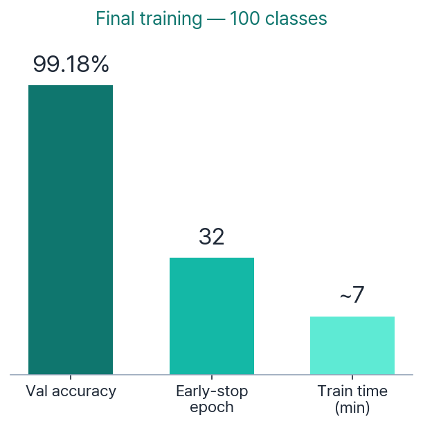
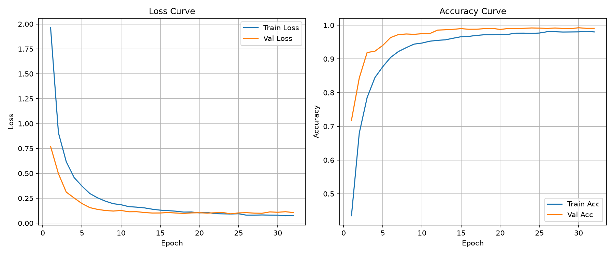
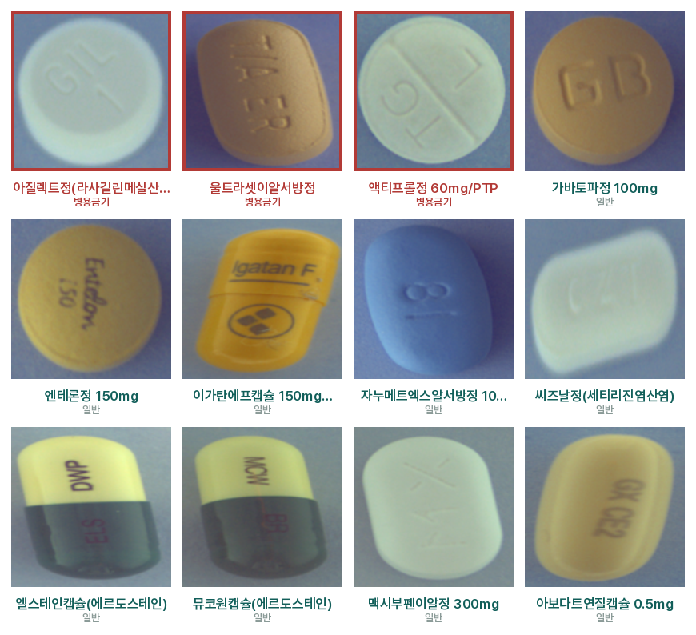
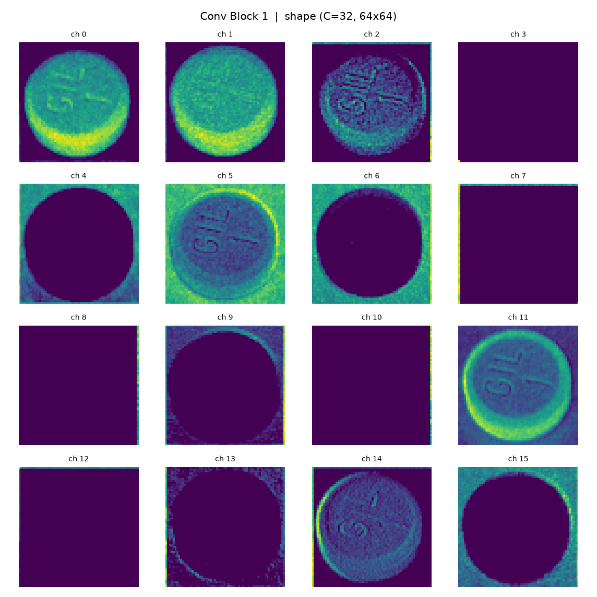
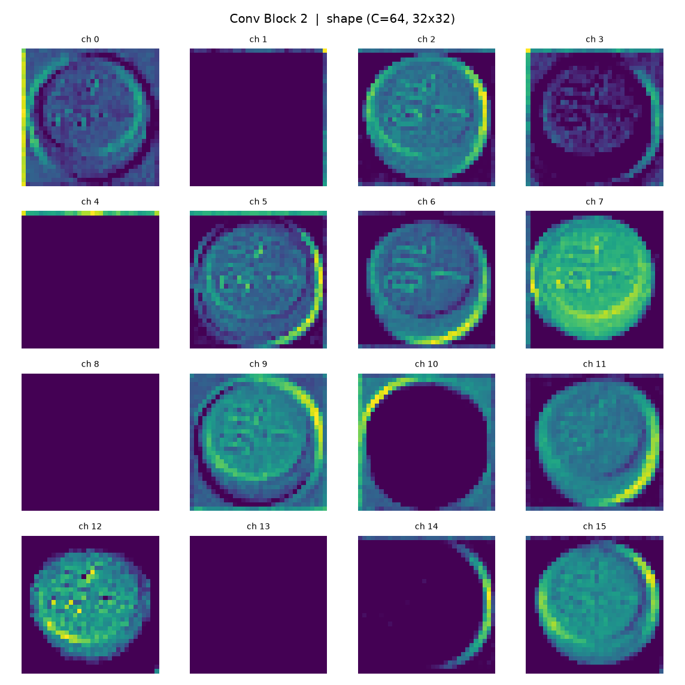
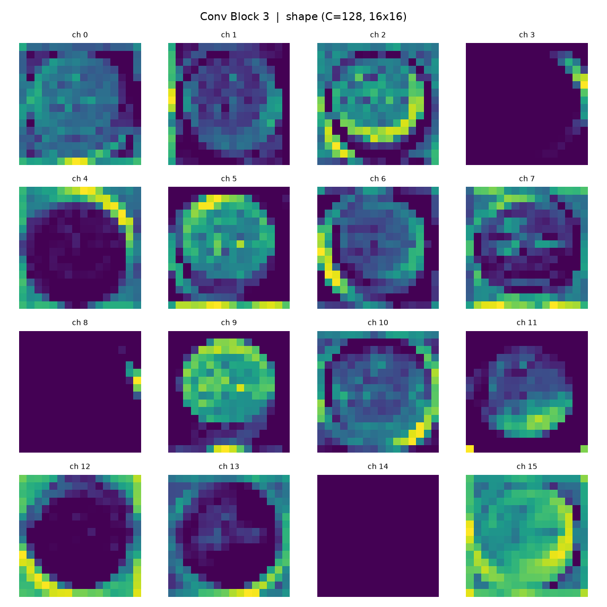
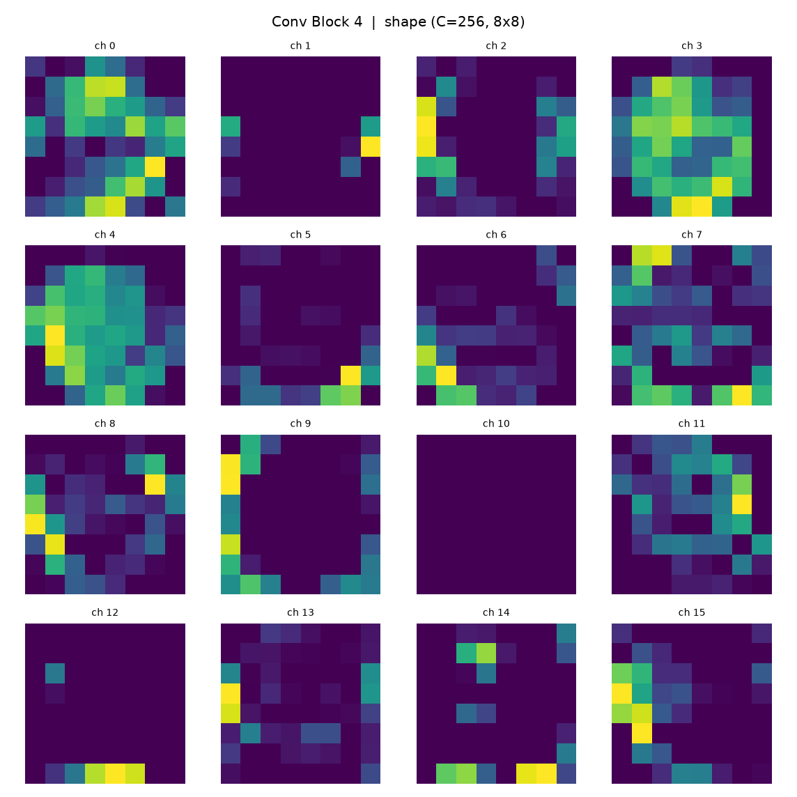
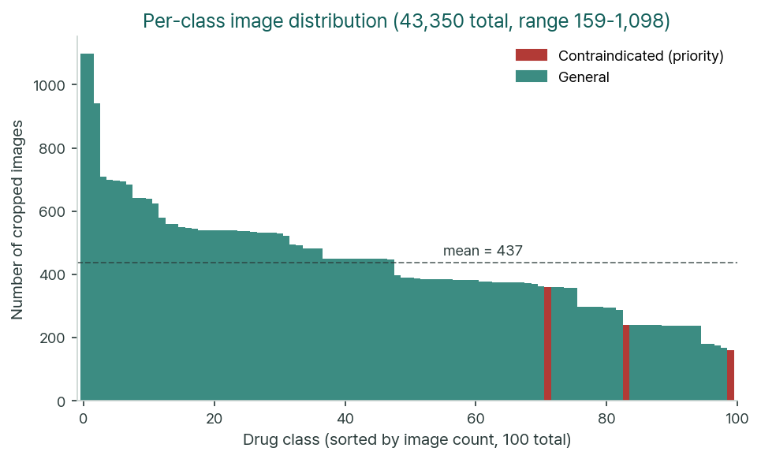
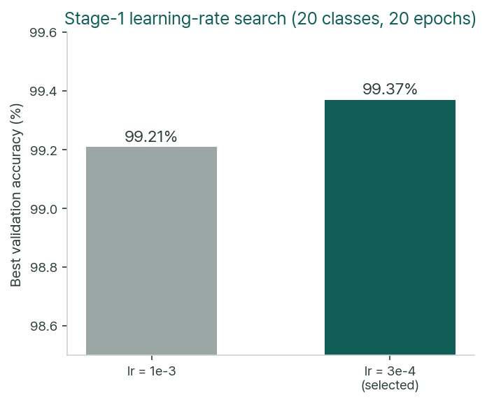
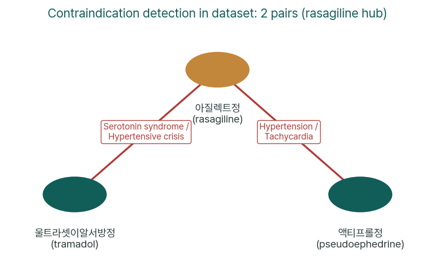

# 💊 ConvDDI

> **Conv**olutional Neural Network for **D**rug–**D**rug **I**nteraction Detection
>
> 약품 이미지를 CNN으로 분류하고, 병용금기 DB와 대조하여 위험한 약물 조합을 자동 탐지합니다.

---

## 개요

ConvDDI는 **사진 한 장으로 약품을 식별하고 병용금기(Drug–Drug Interaction)를 경고**하는 end-to-end 파이프라인입니다.

1. **이미지 전처리** — 4약물 동시 촬영 사진에서 COCO bbox 좌표로 개별 약품 이미지 크롭 (128×128)
2. **CNN 분류** — 자체 설계 DrugCNN (Conv–BN–ReLU–Pool ×4 + FC) 으로 약품 100종 분류
3. **병용금기 검출** — 분류 결과를 성분명으로 변환 후 금기 DB (1,628쌍) 와 자동 대조

---

## 주요 성과

| 항목 | 값 |
|---|---|
| 학습 클래스 | **100종** (118종 중 선정) |
| 검증 정확도 (best) | **99.18%** (epoch 24) |
| 모델 파라미터 | **≈ 8.83M** |
| 데이터셋 내 금기 쌍 검출 | **2쌍** (아질렉트정 중심) |
| 금기 매칭 정밀도 | **Precision / Recall = 1.000** (토큰 매칭 방식) |

<p align="center">
  
  
</p>
<p align="center"><i>좌: 최종 학습 결과 요약 / 우: 100클래스 학습·검증 손실 및 정확도 곡선 (epoch 32, early stop)</i></p>

---

## 아키텍처 — DrugCNN

```
입력 (B, 3, 128, 128)
   │
   ▼
Conv Block 1: Conv(3→32)  / BN / ReLU / MaxPool(2×2) → (B, 32,  64, 64)
   ▼
Conv Block 2: Conv(32→64) / BN / ReLU / MaxPool(2×2) → (B, 64,  32, 32)
   ▼
Conv Block 3: Conv(64→128)/ BN / ReLU / MaxPool(2×2) → (B, 128, 16, 16)
   ▼
Conv Block 4: Conv(128→256)/BN / ReLU / MaxPool(2×2) → (B, 256,  8,  8)
   ▼
Flatten → (B, 16384)
   ▼
FC1(16384→512) + ReLU + Dropout(0.5)
   ▼
FC2(512→100) → Logits
```

### 학습 샘플 이미지

<p align="center">
  
</p>
<p align="center"><i>상단 빨간 테두리: 병용금기 약물 (3종) / 하단: 일반 학습 클래스 샘플</i></p>

### Feature Map 시각화

각 Conv Block이 약품 이미지에서 추출하는 특징을 채널별로 시각화한 결과입니다.

| Block 1 (32ch, 64×64) — 저수준: 에지·색·윤곽 | Block 2 (64ch, 32×32) — 중저수준: 질감·패턴 |
|:---:|:---:|
|  |  |

| Block 3 (128ch, 16×16) — 중고수준: 형태·각인 | Block 4 (256ch, 8×8) — 고수준: 추상적 특징 |
|:---:|:---:|
|  |  |

> 얕은 층(Block 1~2)은 에지·색 대비 같은 **저수준 보편 특징**에 반응하고, 깊은 층(Block 3~4)은 약품의 윤곽·각인 패턴 같은 **고수준 과제 특화 특징**에 반응하는 경향을 확인할 수 있습니다.

---

## 프로젝트 구조

```
ConvDDI/
│
├── README.md
├── .gitignore
│
├── docs/                                  ← 문서 모음
│   ├── PROJECT_PLAN.md                    ← 프로젝트 계획서
│   ├── TECHNICAL_GUIDE.md                 ← 수식 포함 기술 가이드
│   ├── 최종보고서_약품분류.md               ← 최종 보고서
│   ├── 최종보고서_약품분류.html
│   ├── 보고서_슬라이드.html
│   ├── 보고서_약품분류_발표자료.pdf          ← 발표 자료
│   └── 대화정리_약품분류프로젝트.md          ← 개발 과정 정리
│
├── data/
│   ├── images/                            ← 원본 이미지 (TS_1 ~ TS_8)
│   ├── labels/                            ← COCO JSON 라벨 (TL_1 ~ TL_8)
│   ├── cropped/                           ← 크롭된 단일 약품 이미지 (~43,350장)
│   ├── class_map.json                     ← 클래스 인덱스 ↔ 약품코드/성분명 매핑
│   ├── splits.json                        ← train/val/test 분할 (사진 단위, 누수 0건)
│   └── contraindicated_drugs.xlsx         ← 병용금기 DB (1,628쌍)
│
├── src/
│   ├── main.py                            ← 통합 엔트리포인트 (서브커맨드)
│   ├── 0_split.py                         ← 사진(combo) 단위 그룹 분할
│   ├── 1_preprocess.py                    ← bbox 크롭 → 단일 약품 이미지 생성
│   ├── 2_model.py                         ← DrugCNN 모델 정의
│   ├── 3_train.py                         ← 학습 (불균형 보정 · 조기 종료)
│   ├── 4_predict_and_check.py             ← 추론 + 병용금기 DB 조회
│   ├── 5_evaluate.py                      ← test 전용 평가 (F1 · 혼동행렬 · Top-5)
│   ├── 6_feature_maps.py                  ← Conv 블록별 feature map 시각화
│   ├── imbalance.py                       ← 클래스 불균형 대응 유틸
│   ├── examination/
│   │   ├── find_contraindicated.py        ← 데이터셋 × 금기 DB 교차 검색
│   │   ├── compare.py                     ← 라벨 JSON 정합성 검증
│   │   └── validate_contraindication.py   ← 금기 매칭 정량 검증
│   ├── plot/
│   │   └── drug_drug_interactions.py      ← 병용금기 네트워크 시각화
│   └── test/
│       └── test.ipynb                     ← 실험 노트북
│
├── output/
│   ├── best_model.pth                     ← 최종 모델 가중치 (33.7MB)
│   ├── loss_curve.png                     ← 학습/검증 손실 곡선
│   ├── contraindicated_in_dataset.csv     ← 금기 교차 검색 결과
│   ├── contraindication_validation.json   ← 금기 매칭 검증 결과
│   └── report_assets/                     ← 보고서용 차트 · feature map 이미지
│
└── assets/fonts/                          ← 시각화용 폰트 (Pretendard)
```

---

## 빠른 시작

### 환경 설정

```bash
# Python 3.8+ 필요
pip install torch torchvision matplotlib pillow openpyxl scikit-learn
```

### 파이프라인 실행 (순서대로)

```bash
# 1. 전처리 — bbox 크롭으로 단일 약품 이미지 생성
python src/main.py preprocess

# 2. 데이터 분할 — 사진(combo) 단위 train/val/test (70/15/15, 누수 차단)
python src/main.py split

# 3. 학습 — 기본: 가중 CrossEntropyLoss
python src/main.py train

# 4. test 전용 최종 평가
python src/main.py evaluate

# 5. 추론 + 병용금기 체크
python src/main.py predict --images drug1.png drug2.png
```

### 개별 스크립트 직접 실행

```bash
# 하이퍼파라미터 탐색 (소규모)
python src/3_train.py --classes 20 --epochs 20 --lr 3e-4

# Focal Loss로 학습
python src/main.py train --loss focal --gamma 2.0

# Oversampling으로 학습
python src/main.py train --loss weighted --sampler weighted

# Feature map 시각화
python src/6_feature_maps.py --image data/cropped/000_K-031863/example.png

# 금기 매칭 검증
python src/examination/validate_contraindication.py
```

---

## 학습 설정

| 구성 요소 | 값 | 비고 |
|---|---|---|
| 손실 함수 | 가중 CrossEntropyLoss (기본) | Focal Loss, 일반 CE 전환 가능 |
| 옵티마이저 | Adam | lr=3e-4 (2단계 탐색으로 선정) |
| Batch Size | 128 | RTX 4090 기준 메모리·속도 균형 |
| Dropout | 0.5 | FC1 뒤 적용 |
| 정규화 | BatchNorm + ImageNet 통계 | 채널별 μ/σ 표준화 |
| 조기 종료 | patience=8 | val_loss 기준 |
| 데이터 증강 | RandomRotation, ColorJitter 등 | 촬영 각도·조명 변화 대응 |
| 데이터 분할 | train/val/test = 70/15/15 | **사진(combo) 단위 그룹 분할**, 누수 0건 |

<p align="center">
  
  
</p>
<p align="center"><i>좌: 100개 클래스별 이미지 수 분포 (빨간색: 병용금기 약물) / 우: 1단계 학습률 탐색 결과</i></p>

---

## 병용금기 검출

데이터셋 100개 학습 클래스 내에서 검출된 금기 조합:

| 약물 1 | 성분 1 | 약물 2 | 성분 2 | 위험 |
|---|---|---|---|---|
| 아질렉트정 | rasagiline | 울트라셋이알서방정 | tramadol | 세로토닌증후군 |
| 액티프롤정 60mg | pseudoephedrine | 아질렉트정 | rasagiline | 고혈압 · 빈맥 |

> **아질렉트정(rasagiline)** 이 두 쌍 모두에 관여하는 핵심 노드 역할.

<p align="center">
  
</p>
<p align="center"><i>데이터셋 내 병용금기 네트워크 — 아질렉트정(rasagiline)이 허브 노드</i></p>

### 매칭 정확도 (검증셋 16케이스)

| 방식 | Precision | Recall | F1 | Accuracy |
|---|---|---|---|---|
| 기존 substring | 0.636 | 0.778 | 0.700 | 0.625 |
| **개선 토큰 매칭** | **1.000** | **1.000** | **1.000** | **1.000** |

---

## 평가 지표

독립 test split에서만 산출 (`5_evaluate.py`):

- **Top-1 / Top-5 Accuracy** — 최종 예측 및 상위 5개 후보 정확도
- **Macro / Weighted F1-score** — 클래스 불균형(7.0배) 환경에서 소수 클래스 성능 반영
- **100×100 혼동행렬** — 약품 간 오분류 패턴 진단

출력물: `output/eval/` (metrics.json, classification_report.csv, confusion_matrix.csv/png)

---

## 산출물 (output/)

| 파일 | 설명 |
|---|---|
| `best_model.pth` | 최종 모델 가중치 (classes=100, val_acc=0.9918, epoch=24) |
| `loss_curve.png` | 학습/검증 손실 곡선 |
| `contraindicated_in_dataset.csv` | 금기 교차 검색 결과 |
| `contraindication_validation.json` | 매칭 정확도 검증 결과 |
| `report_assets/` | 보고서 차트 (클래스 분포, LR 비교, 금기 네트워크, feature map 등) |

---

## 한계점 및 향후 과제

### 데이터 측면

| 한계 | 설명 |
|---|---|
| **사전 크롭 의존** | 실사용 시에는 사용자가 촬영한 사진에서 약품 위치를 직접 찾아야 하나, 본 시스템은 bbox 좌표가 주어진 전처리 크롭에 의존한다. 진정한 end-to-end 시스템이 되려면 객체 검출(YOLO 등)이 선행되어야 한다. |
| **폐쇄형 클래스** | 학습한 100종 외의 약품은 분류 불가. 실세계에는 수만 종의 약품이 존재하므로 현재 모델의 실용성은 제한적이다. |
| **클래스 불균형** | 최다/최소 클래스 간 이미지 수 차이가 7.0배. 가중 손실·Focal Loss·Oversampling으로 보정했으나 소수 클래스의 정확도가 다수 클래스에 미치지 못할 가능성이 있다. |
| **촬영 환경 한정** | 학습 데이터가 통제된 환경에서 촬영되어, 실제 가정·약국의 다양한 조명·배경에 대한 일반화 성능은 미검증이다. |

### 모델 측면

| 한계 | 설명 |
|---|---|
| **전이학습 미사용** | ResNet·EfficientNet 등 사전학습 모델 없이 처음부터 학습(from scratch). 전이학습 대비 데이터 효율과 정확도에서 불리할 수 있다. |
| **낮은 입력 해상도** | 128×128로 리사이즈하여 약품 표면의 미세 각인·글자를 놓칠 수 있다. 224×224 이상에서 성능 향상 가능성이 있다. |
| **FC 파라미터 집중** | 전체 8.83M 중 ~95%가 FC1(16,384×512)에 몰려 있어 과적합 위험이 구조적으로 존재한다. Global Average Pooling 적용 시 파라미터를 대폭 줄일 수 있다. |

### 병용금기 검출 측면

| 한계 | 설명 |
|---|---|
| **금기 쌍 희소성** | 100개 학습 클래스 내 실제 금기 조합은 2쌍(약물 3종)뿐으로, 검출 기능의 실증 범위가 매우 좁다. |
| **성분명 동의어 미처리** | 토큰 매칭은 `aspirin` ↔ `acetylsalicylic acid`처럼 표기 자체가 다른 동의어를 매칭하지 못한다. 동의어 사전 구축이 필요하다. |
| **복합 상호작용 미반영** | 현재는 2개 약물 간 쌍별(pairwise) 금기만 확인하며, 3개 이상 약물의 복합 상호작용은 검출하지 않는다. |

### 향후 과제

1. **객체 검출 통합** — YOLO 등을 전처리에 도입하여 임의 사진에서 약품을 자동 검출·크롭하는 진정한 end-to-end 파이프라인 구축
2. **전이학습 도입** — ResNet-50 등 사전학습 backbone으로 교체하여 정확도 및 데이터 효율 개선
3. **클래스 확장** — 118종 전체 또는 외부 약품 데이터셋과 결합하여 실용적 커버리지 확보
4. **성분명 동의어 사전** — RxNorm 등 표준 약품 온톨로지를 활용한 동의어 매핑으로 금기 검출 재현율 향상
5. **독립 test 재측정** — 누수 차단 분할(`0_split.py`)로 재학습 후 test split에서의 정량 평가 완료

---

## 참고 문헌

- Ioffe & Szegedy (2015). *Batch Normalization: Accelerating Deep Network Training.* ICML.
- Srivastava et al. (2014). *Dropout: A Simple Way to Prevent Neural Networks from Overfitting.* JMLR.
- Kingma & Ba (2015). *Adam: A Method for Stochastic Optimization.* ICLR.
- Lin et al. (2017). *Focal Loss for Dense Object Detection.* ICCV.

---

## 라이선스

이 프로젝트의 소스 코드 및 문서는 **[CC BY-NC 4.0](https://creativecommons.org/licenses/by-nc/4.0/deed.ko)** (Creative Commons Attribution-NonCommercial 4.0 International) 라이선스를 따릅니다.

- **저작자표시 (Attribution):** 적절한 출처 표기, 라이선스 링크 제공, 수정 여부를 표시해야 합니다.
- **비영리 (NonCommercial):** 이 저작물은 영리 목적으로 사용할 수 없습니다.

> **참고:** 폰트(`Pretendard`) 등 외부 자산은 자체 라이선스([OFL 1.1](file:///Users/junho/PythonProjects/deeplearning_class/team_project_06/drug_classification/assets/fonts/LICENSE))를 따릅니다.
